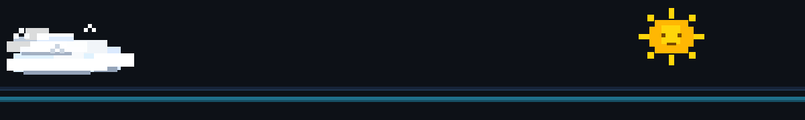
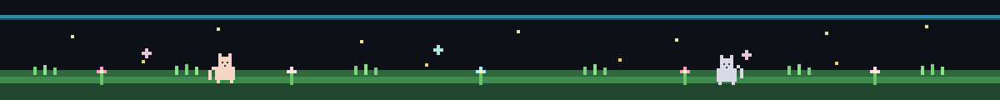

<!-- HAREKETLİ PİKSEL GÖKYÜZÜ -->

 

<!-- PİKSEL ARI VE ÇİÇEK GIF'LERİ -->

<!-- PİKSEL FONTLU BÜYÜK BAŞLIK -->

 

<!-- ALT HAREKETLİ PİKSEL AYIRICI -->

  

<!-- SOSYAL ROZETLER -->

  

  

  

## 🌿 Hakkımda

- ✨ **Konum:** İstanbul, Türkiye 📍
- 🌸 **Odak:** Backend Systems, Clean Architecture & AI
- 🚀 **Aktif Proje:** [FlowDesk](https://github.com/zeynep0zge/FlowDesk)
- 🐛 Şu an: kod yazıyor, bug avlıyor, kahve tüketiyor
- 🐝 Öğrenmeye devam: AI destekli sistemler

## 🎨 Araç Kutusu & Yetenekler

## 📊 İstatistikler & Metrikler

 

 

<!-- ANİMASYONLU AKTİVİTE GRAFİĞİ -->

## 🐝 Katkı Bahçem

<!--START_SECTION:waka-->

<!--END_SECTION:waka-->

